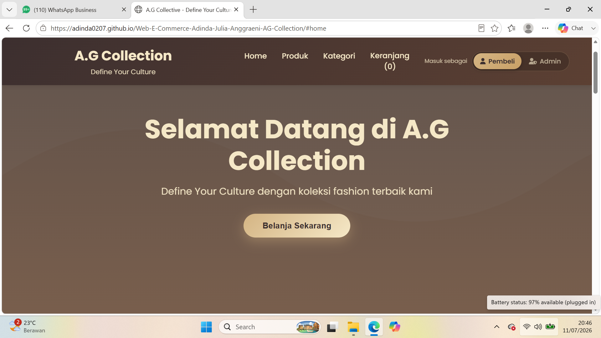
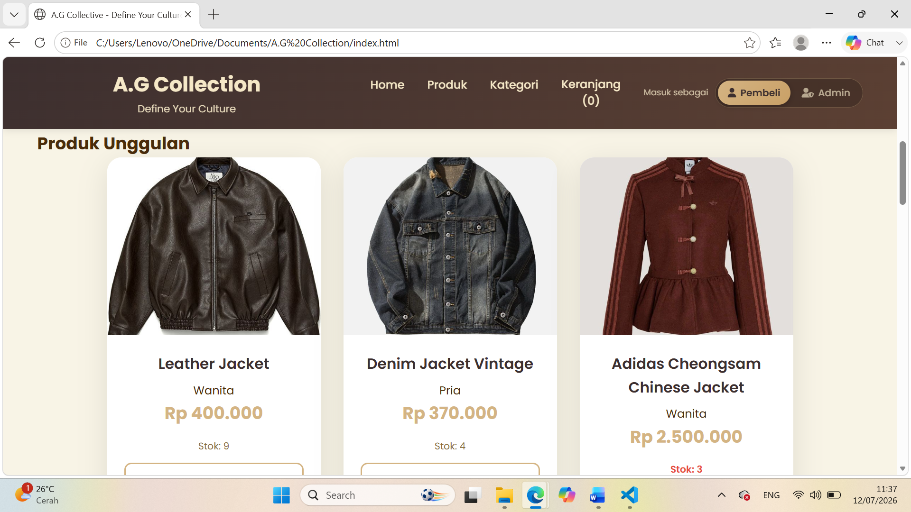
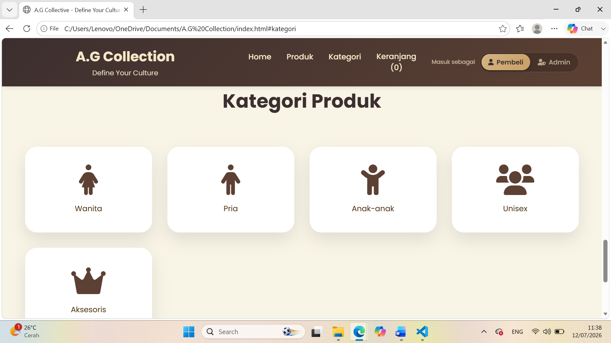
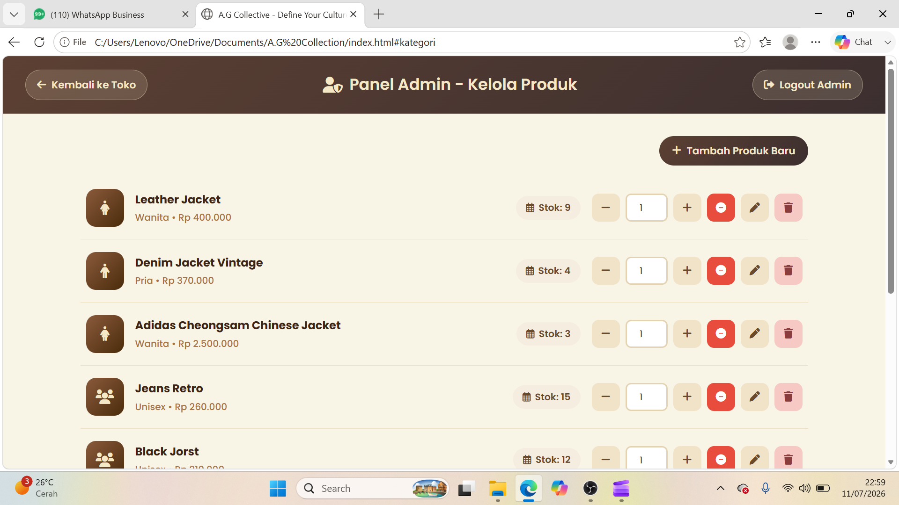
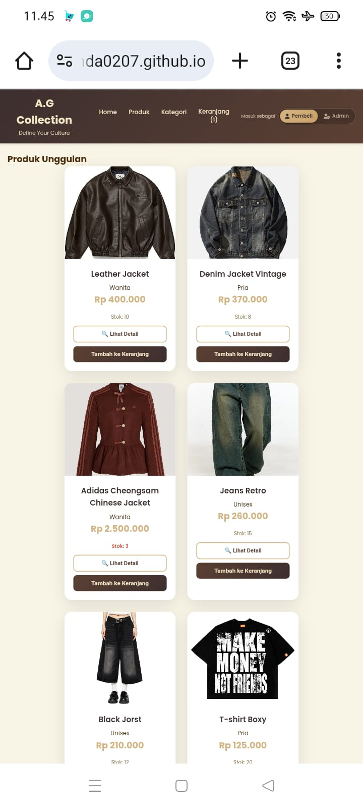
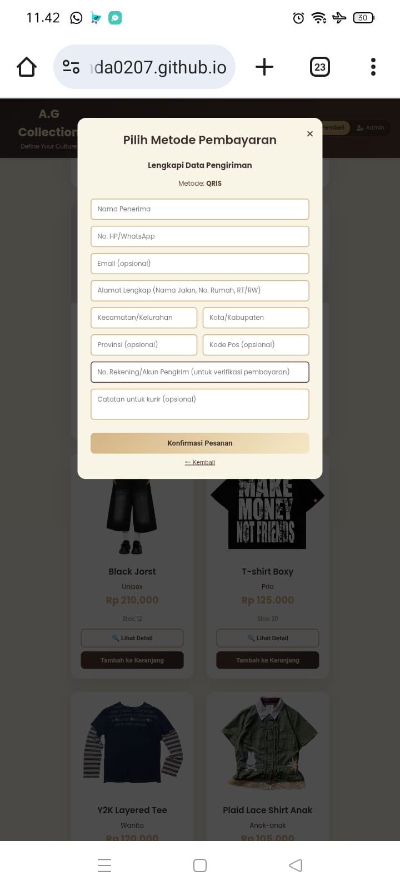
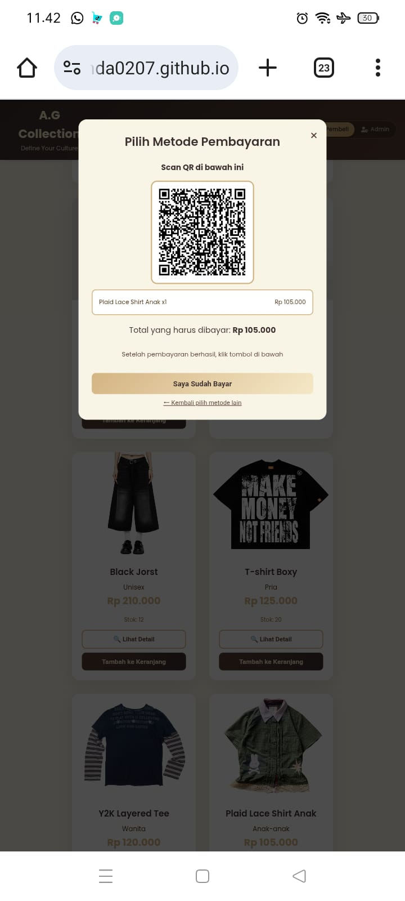

# A.G Collection — Business Overview
**"Define Your Culture"**

---

## 👤 Identitas

| Keterangan | Detail |
|---|---|
| **Nama** | *Adinda Julia Anggraeni* |
| **NIM** | *209250044* |
| **Kelas** | *ABI 2* |

---

## Dokumentasi Tampilan Website

**Halaman Home-Dsktop**
Tampilan awal website dengan hero section dan tagline "Define Your Culture".



**Halaman Produk-Desktop**
Menampilkan daftar produk unggulan lengkap dengan kategori, harga, dan stok.



**Halaman Kategori-Desktop**
Navigasi produk berdasarkan kategori: Wanita, Pria, Anak-anak, Unisex, dan Aksesoris.



**Halaman Admin-Desktop**
Dimana admin bisa login untuk mengelola produk, seperti menambah produk baru dan mengubah stok.
Jika ingin masuk mode admin harus memasukan username dan password.
Username: admin
Password: admin123



**Tampilan Mobile — Produk Unggulan**
Website responsif dan tetap nyaman diakses lewat perangkat mobile.



**Tampilan Mobile Simulasi Checkout — Form Data Pengiriman**
Pelanggan mengisi data penerima dan alamat pengiriman sebelum lanjut ke pembayaran.



**Tampilan Mobile Simulasi Checkout — Pembayaran QRIS**
Simulasi pembayaran menggunakan QRIS lengkap dengan ringkasan pesanan dan total tagihan.



---

## Video Demo

Video demonstrasi alur penggunaan website A.G Collection (dari Home hingga proses checkout) link YouTube:

📺 **YouTube:** [https://youtu.be/IzbHQU0vRIU](https://youtu.be/IzbHQU0vRIU)

---

## 📑 Daftar Isi

1. [Nama Bisnis, Deskripsi, dan Value Proposition](#1-nama-bisnis-deskripsi-dan-value-proposition)
2. [Target Market & Segmentasi Pelanggan](#2-target-market--segmentasi-pelanggan)
3. [Analisis Pasar Singkat & Kompetitor](#3-analisis-pasar-singkat--kompetitor)
4. [Strategi Manajemen Produk & Katalog](#4-strategi-manajemen-produk--katalog)
5. [Model Bisnis & Revenue Stream](#5-model-bisnis--revenue-stream)
6. [Strategi Harga, Promosi, dan Diskon](#6-strategi-harga-promosi-dan-diskon)
7. [Proses Checkout & Simulasi Payment Gateway](#7-proses-checkout--simulasi-payment-gateway)
8. [Kontak](#kontak)

---

## 1. Profil Bisnis

**Nama Bisnis:** A.G Collection
**Tagline:** *Define Your Culture*

**Deskripsi:**
A.G Collection adalah toko fashion online yang menjual pakaian dan aksesoris untuk pria, wanita, anak-anak, dan unisex melalui platform e-commerce sendiri. Katalog mengusung gaya yang memadukan streetwear, vintage, dan budaya urban — mulai dari jaket kulit, denim vintage, cheongsam modern, hingga t-shirt boxy dan aksesoris.

**Value Proposition:**
- **Kurasi gaya yang punya identitas** — bukan sekadar toko baju, tapi brand dengan tagline "Define Your Culture" yang menyasar anak muda yang ingin fashion sebagai bentuk ekspresi diri.
- **Kategori produk yang lengkap** — dalam satu platform ada (Wanita, Pria, Anak-anak, Unisex, Aksesoris)
- **Proses belanja online yang simpel:** — pilih produk → keranjang → checkout → pembayaran
- **Beragam metode pembayaran lokal** yang familiar bagi pelanggan Indonesia (COD, QRIS, Transfer Bank, E-Wallet)
- **Produk lintas segmen** — dari item premium (Cheongsam Rp 2.500.000) sampai item entry-level (Aksesoris mulai Rp 89.000), sehingga menjangkau berbagai daya beli dalam satu brand.
- **Kedekatan dengan komunitas** — aktif di Instagram & TikTok untuk membangun engagement dan konten yang relate dengan target market.

---

## 2. Target Market & Segmentasi Pelanggan

**Target Market Utama:**
- Remaja dan dewasa muda usia 15–35 tahun
- Konsumen yang tertarik pada fashion streetwear/kasual dengan identitas kultural
- Pengguna aktif media sosial (Instagram, TikTok) yang mengikuti tren fashion

| Segmen | Karakteristik | Kebutuhan Utama |
|---|---|---|
| **Gen Z Urban (16–24 th)** | Aktif di media sosial, suka streetwear & Y2K style | Produk kekinian, harga terjangkau, konten visual menarik |
| **Young Professional (23–30 th)** | Butuh outfit kasual-formal, daya beli lebih tinggi | Kualitas bahan, item statement (jaket kulit, cheongsam) |
| **Orang Tua Muda** | Membeli untuk anak | Produk anak-anak yang nyaman & terjangkau |
| **Unisex/Gender-neutral shopper** | Tidak terpaku gender dalam berpakaian | Pilihan unisex (jeans retro, jorst) |

**Segmentasi berdasarkan geografi:** saat ini berpusat di Bandung dengan potensi ekspansi ke kota-kota besar lain (Jakarta, Surabaya, Yogyakarta) mengingat produk dijual online dan bisa dikirim ke seluruh Indonesia.

**Segmentasi berdasarkan perilaku:** Terbiasa belanja online, aktif di media sosial, sensitif terhadap promo/diskon

---

## 3. Analisis Pasar Singkat & Kompetitor

**Tren pasar:**
- Fashion lokal Indonesia tumbuh didorong oleh social commerce (TikTok Shop, Instagram Shopping) dan preferensi konsumen muda terhadap brand lokal yang punya "cerita" dan identitas kuat.
- Konsumen semakin peduli pada kecepatan checkout dan variasi metode pembayaran digital (e-wallet, QRIS) dibanding transfer manual saja.

**Kompetitor:**
| Jenis Kompetitor | Contoh | Kekuatan Mereka | Peluang A.G Collection |
|---|---|---|---|
| Brand lokal streetwear | Erigo, Thanksinsomnia | Brand awareness besar, distribusi luas | Diferensiasi lewat gaya lebih personal & harga bersaing di segmen aksesoris/entry-level |
| Marketplace fashion | Shopee/Tokopedia fashion sellers | Jangkauan pasar sangat luas, promo agresif | Pengalaman belanja terkurasi (bukan lautan produk), branding yang lebih kuat |
| Toko fashion Bandung offline | Toko-toko di Dago/Cihampelas | Kepercayaan pembeli lokal, bisa coba langsung | Kenyamanan belanja online 24 jam + katalog kategori jelas |

**Diferensiasi A.G Collection:**
- Branding yang berfokus pada ekspresi budaya/identitas personal
- Pengalaman belanja langsung dari website sendiri (bukan hanya marketplace)
- Fleksibilitas metode pembayaran termasuk COD untuk membangun kepercayaan pelanggan baru

---

## 4. Strategi Manajemen Produk & Katalog

**Kategori Produk:**
1. Wanita
2. Pria
3. Anak-anak
4. Unisex
5. Aksesoris

**Strategi katalog:**
1. **Deskripsi produk yang menarik** — setiap produk dilengkapi nama, bahan, ukuran, dan cerita singkat yang mendukung tema "Define Your Culture"
2. **Foto produk berkualitas** — foto produk beresolusi tinggi dengan sudut pandang depan/belakang/detail, konsisten dari segi pencahayaan dan latar untuk membangun identitas brand
3. **Update katalog berkala:** — admin dapat menambah produk baru secara langsung melalui Panel Admin (fitur "Tambah Produk Baru")
4. **Manajemen stok:** — admin mengelola ketersediaan stok agar produk yang sudah habis tidak tetap tampil dapat dibeli
5. **Bundling & koleksi musiman:** — produk dikelompokkan dalam koleksi tematik untuk mendorong cross-selling antar kategori

---

## 5. Model Bisnis & Revenue Stream

**Model Bisnis:** Direct-to-Consumer (D2C) E-Commerce — penjualan produk fashion secara langsung ke konsumen akhir melalui website sendiri.

**Revenue Stream:**
1. Penjualan produk fashion (pakaian & aksesoris) sebagai sumber pendapatan utama
2. Potensi *bundling package* (contoh: paket outfit lengkap dengan harga khusus)
3. Produk eksklusif/limited edition item dengan harga premium (seperti Cheongsam Rp 2.500.000) untuk margin lebih tinggi.
4. Potensi B2B/reseller membuka program reseller/dropship untuk memperluas distribusi tanpa menambah beban operasional toko sendiri.
5. Kolaborasi dengan micro-influencer lokal di Bandung untuk cross-promotion.

---

## 6. Strategi Harga, Promosi, dan Diskon

**Strategi harga saat ini:** 
- Penetapan harga kompetitif berdasarkan segmen menengah, mempertimbangkan biaya produksi/bahan dan harga kompetitor sejenis
- Harga berbeda per kategori sesuai kompleksitas produk (aksesoris vs pakaian utama)

**Strategi promosi:**
- Promosi melalui media sosial (Instagram, TikTok) dengan konten visual dan storytelling brand
- Kolaborasi dengan micro-influencer lokal untuk memperluas jangkauan
- Program referral/ajak teman untuk mendorong penjualan dari mulut ke mulut

**Strategi Diskon:**
- Diskon musiman (tanggal kembar, akhir tahun, ganti musim)
- Diskon pembelian pertama untuk pelanggan baru 
- Kode voucher/promo khusus follower media sosial
- Flash sale berkala untuk mendorong urgensi pembelian
- Flash sale terbatas waktu yang dipromosikan lewat Instagram/TikTok untuk mendorong urgensi beli.
- Gratis ongkir dengan minimum belanja tertentu untuk menaikkan nilai transaksi.

---

## 7. Proses Checkout & Simulasi Payment Gateway

**Alur Checkout:**
1. Pelanggan memilih produk dan menambahkannya ke **Keranjang Belanja**
2. Pelanggan meninjau total belanja pada halaman keranjang
3. Klik **Checkout** untuk melanjutkan ke pembayaran
4. Pelanggan memilih metode pembayaran yang tersedia
5. Pelanggan melengkapi data pengiriman (nama, alamat, kontak)
6. Konfirmasi pesanan dikirim setelah pembayaran berhasil dilakukan

**Metode Pembayaran yang Disimulasikan:**
- 📦 **COD (Cash on Delivery)** — bayar saat barang diterima
- 🔳 **QRIS** — pemindaian kode QR untuk pembayaran instan
- 🏦 **Transfer Bank** — BCA, BNI, BRI, Mandiri
- 📱 **E-Wallet** — OVO, GoPay, DANA, ShopeePay

---

## Struktur Proyek

```
Tugas-UAS-Adinda-Julia-Anggraeni
│
├── index.html              
├── style.css          
├── script.js
├── image
```

---

## Kontak

- 📧 Email: info@agcollection.com
- 📱 WhatsApp: +62 857-9701-6732
- 📍 Alamat: Jl. Fashion No. 142, Bandung–Dago
- 📷 Instagram: [@dnda0251](https://www.instagram.com/dnda0251?igsh=MXNha2h5NXh2NWg2Mg==)

---

© 2026 A.G Collection. All rights reserved.
